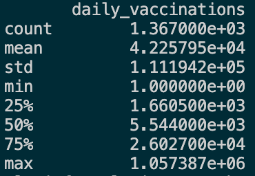
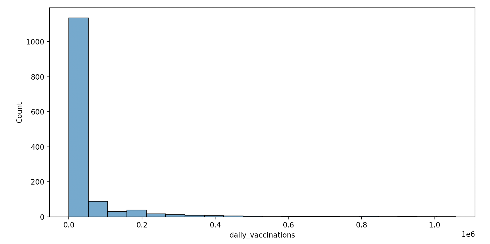
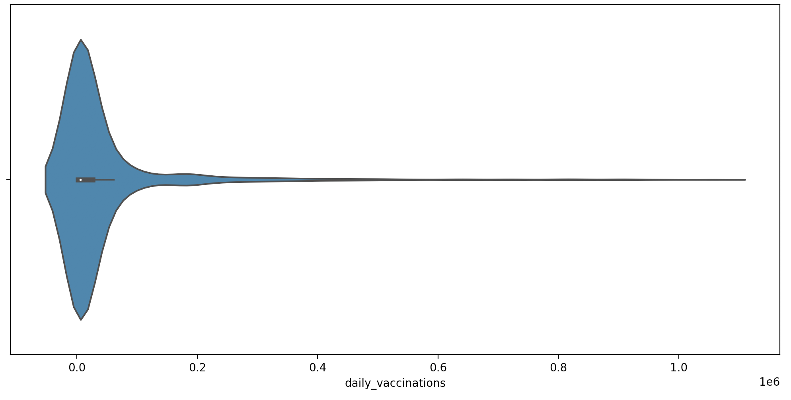
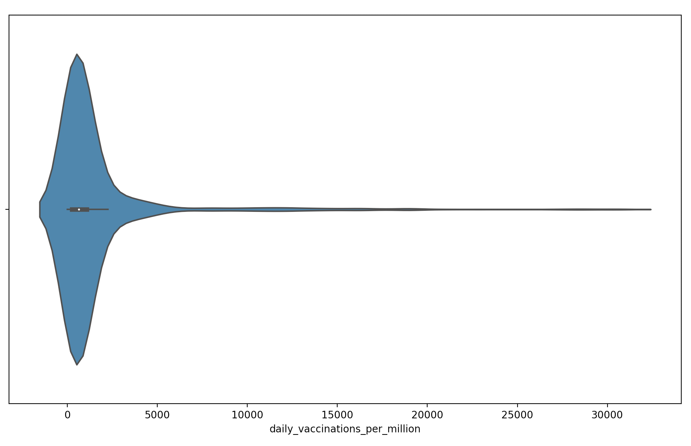
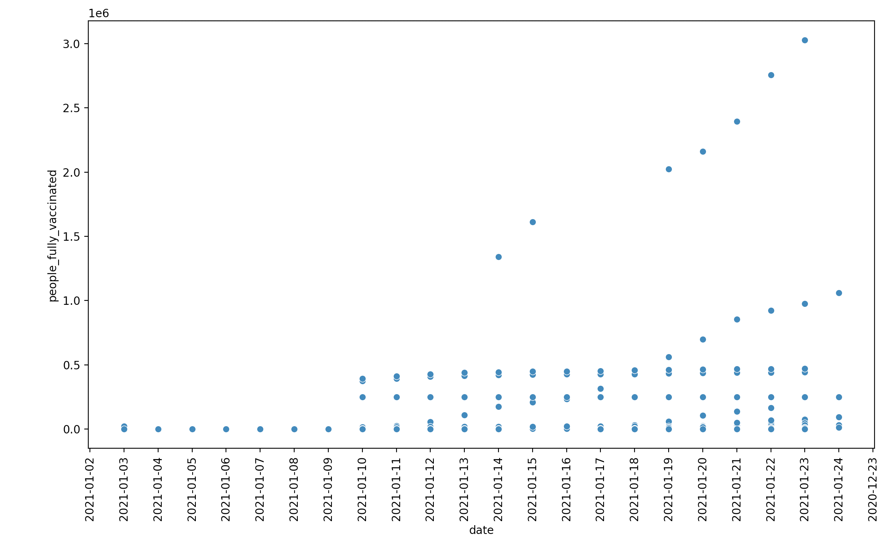
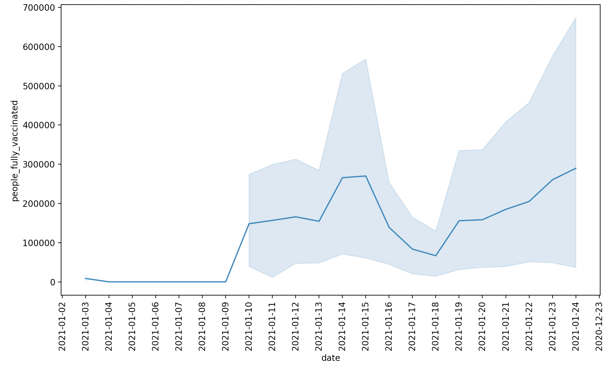

---
#Frontmatter
layout: post
title: Descriptive Lab
---

### Dataset Used
I am using the country vaccinations dataset.

### Dataset Analysis & Conclusions 
First, I wanted to do some initial analysis by using the .describe() in the seaborn library.
```
country_vaccinations[['daily_vaccinations']].describe()
```
I decided to do analysis on the daily_vaccinations variable. Below are the summary of the statistics for daily_vaccinations:


I then used this data to create a histogram, plotting count or frequency versus daily vaccinations.


I realized that the data was extremely right skewed, so I also created a violin plot, because they are nice to clearly and dynamically show skews in data. 


When thinking about it, this skew made sense since most countries do not have the economic resources or technology to vaccinate their populations, especially larger populations. To connect analysis of this variable with another, I also created a violin plot for the daily_vaccinations_per_million variable as shown below. I chose this variable because it would standardize in terms of number of people, and be less dependent on population counts. 



Unfortunately, this datapoint revealed the same skew as the daily vaccinations variable. 

I then wanted to analyze this data with some reference to time, so I created vizualizations plotting date and the people_fully_vaccinated variable. I first tried to create a scatterplot to analyze the state of COVID with respect to time shown below.


Clearly, though, this was not the right graph to use here, but, hey, you win some you lose some. There is too much variance for each date, so it would be better to use a lineplot to try to identify a collective pattern with this variable. Below is the line plot that shows people_fully_vaccinated variable vs date. 


AH, this is better and good! You can see that there is an upward trend for peoping being vaccinated as time goes on. More mathematically, this plot shows exponential growth in terms of people receiving vaccinations.

In this lab, I improved my data vizualization skills and am a bit more hopeful for the future with my last plot, but we still have aways to go.


